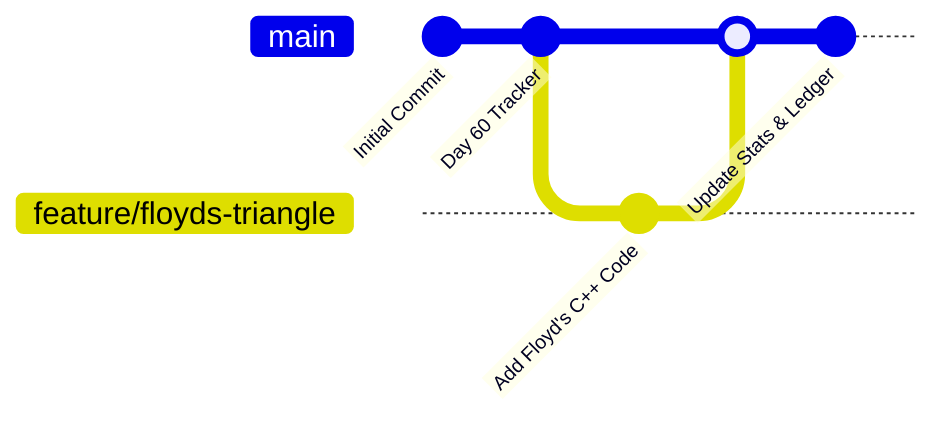

# 🛠️ Git Branching & Repo Workflow Guide

This document describes how this repository works, how to use Git branches, the command syntax, and the overall workflow for tracking the 60 Days Hell Period.

---

## 1. How the Repo Tracking is Working

This repository acts as an interactive progress ledger.
* **Daily Ledger & Countdown:** The challenge is set up for 60 days, counting downwards from Day 60 to Day 1. The ledger acts as a tracker mapping every day to its corresponding date.
* **Active vs. Missed Days:**
  * **Active Day:** A day where at least **1 code solution** is committed and pushed.
  * **Missed Day:** A day with **0 solutions** submitted. 
  * If a day is missed, it counts toward the **Crucial Days Missed** statistic in the main [README.md](file:///e:/60%20Days%20Hell%20Period/README.md).
* **Automated Structure:**
  * Files are organized by topic (e.g., [Matrix](file:///e:/60%20Days%20Hell%20Period/Matrix), [Math](file:///e:/60%20Days%20Hell%20Period/Math), [Strings](file:///e:/60%20Days%20Hell%20Period/Strings)).
  * Inside each directory, a topic-specific `README.md` catalogues the difficulty and problem name.
  * Main statistics tables and Mermaid charts in the root `README.md` are updated to keep visual tracks of consistency and topic distributions.

---

## 2. Git Branching & Workflow Guide

Using branches helps isolate your work (e.g., testing new problem solutions) without affecting the stable `main` branch until the code is fully verified.

### 🌿 What is a Branch?
A branch represents an independent line of development. Think of it as a parallel copy of the repository where you can commit changes safely.



---

### 💻 Essential Git Commands

Here is the cheat sheet of commands used to create, manage, and merge branches.

#### 1. Checking Branch Status
```bash
# List all local branches (the active branch is marked with an asterisk *)
git branch

# List both local and remote branches
git branch -a
```

#### 2. Creating and Switching Branches
```bash
# Create a new branch called "feature/my-solution"
git branch feature/my-solution

# Switch to the new branch
git checkout feature/my-solution

# shortcut: Create AND switch to the new branch in a single command
git checkout -b feature/my-solution
```

#### 3. Staging and Committing Changes
```bash
# Stage the modified or new files
git add "Matrix/Floyds Triangle Pattern.cpp"
git add README.md

# Commit the changes with a meaningful message
git commit -m "Solved: Floyds Triangle Pattern [Matrix]"
```

#### 4. Merging Back to Main
Once your code compiles and is verified:
```bash
# Step 1: Switch back to the main branch
git checkout main

# Step 2: Merge the changes from your feature branch into main
git merge feature/my-solution
```

#### 5. Deleting Branches (Cleanup)
After a successful merge, clean up the branch to keep the workspace tidy:
```bash
# Delete the local branch
git branch -d feature/my-solution

# Force-delete a branch (if it has unmerged changes you want to discard)
git branch -D feature/my-solution
```

#### 6. Pushing and Pulling Changes
```bash
# Push main branch commits to remote repository (GitHub)
git push origin main

# Pull latest commits from GitHub to update your local copy
git pull origin main
```

---

### 🔄 Step-by-Step Daily Workflow Example

When starting a new problem (e.g., solving Floyd's Triangle on Day 43):

1. **Keep main up-to-date:**
   ```bash
   git checkout main
   git pull origin main
   ```
2. **Create a topic branch:**
   ```bash
   git checkout -b feature/floyds-triangle
   ```
3. **Write/Modify code:** Add `Floyds Triangle Pattern.cpp` under the `Matrix/` folder.
4. **Test & Verify:** Compile and run locally to make sure it works.
5. **Stage and Commit:**
   ```bash
   git add Matrix/
   git commit -m "Add Floyds Triangle Pattern"
   ```
6. **Integrate and Sync:**
   ```bash
   git checkout main
   git merge feature/floyds-triangle
   # Update main README.md and stats...
   git add README.md
   git commit -m "Update tracker stats and activity ledger"
   git push origin main
   ```
7. **Cleanup:**
   ```bash
   git branch -d feature/floyds-triangle
   ```
