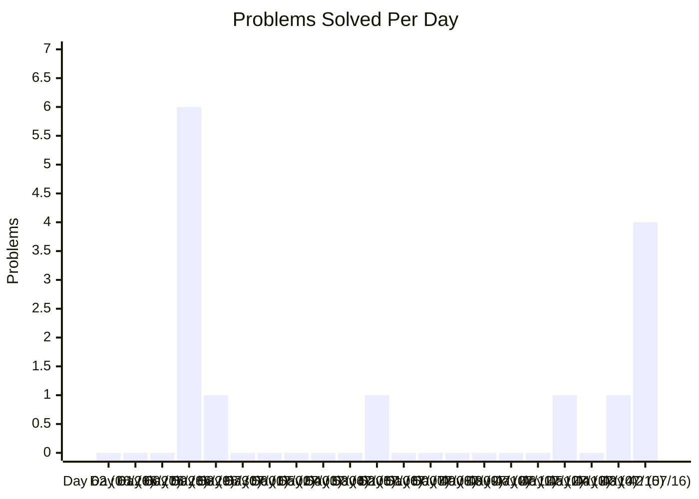
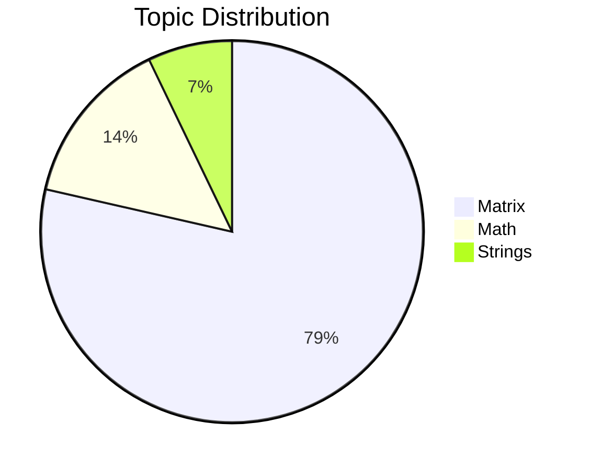

# 🧠 62 Days Hell Period - DSA Tracker

Welcome to my Data Structures and Algorithms (DSA) preparation repository! This space is dedicated to tracking my daily progress, coding challenges, and conceptual growth over an intensive 62-day sprint.

---

## 📊 Repository Statistics

| Metric | Details |
| :--- | :--- |
| **Total Problems Solved** | 14 |
| **Latest Problem** | [Hollow Rhombus Pattern](file:///e:/62%20Days%20Hell%20Period/Matrix/Hollow%20Rhombus%20Pattern.cpp) |
| **Last Updated** | 2026-07-16 |
| **Countdown** | ⏳ **Day 42** (42 Days Remaining out of 62) |
| **Total Days Elapsed** | 21 Days |
| **Days Pushed (Active)** | 🟢 6 Days |
| **Days with Pseudo Approach** | 🟡 14 Days |
| **Days Missed** | 🔴 1 Day |

> [!NOTE]
> **TRACKING STATUS:**
> You have active participation on **6 days** and pseudo approaches documented for **14 days** out of the 21 days elapsed. Keep converting those pseudo approaches into actual solutions! 🚀

---

## 📂 Topic-wise Progress

Below is the distribution of solved problems across various DSA topics:

| Topic | Count | Status |
| :--- | :---: | :--- |
| **Arrays** | 0 | 🟥 Not Started |
| **Strings** | 1 | 🟩 In Progress |
| **Linked List** | 0 | 🟥 Not Started |
| **Stack** | 0 | 🟥 Not Started |
| **Queue** | 0 | 🟥 Not Started |
| **Binary Search** | 0 | 🟥 Not Started |
| **Recursion** | 0 | 🟥 Not Started |
| **Backtracking** | 0 | 🟥 Not Started |
| **Trees** | 0 | 🟥 Not Started |
| **BST** | 0 | 🟥 Not Started |
| **Heap** | 0 | 🟥 Not Started |
| **Graph** | 0 | 🟥 Not Started |
| **Dynamic Programming** | 0 | 🟥 Not Started |
| **Greedy** | 0 | 🟥 Not Started |
| **Sliding Window** | 0 | 🟥 Not Started |
| **Two Pointers** | 0 | 🟥 Not Started |
| **Bit Manipulation** | 0 | 🟥 Not Started |
| **Matrix** | 11 | 🟩 In Progress |
| **Trie** | 0 | 🟥 Not Started |
| **Segment Tree** | 0 | 🟥 Not Started |
| **Disjoint Set** | 0 | 🟥 Not Started |
| **Math** | 2 | 🟩 In Progress |
| **Prefix Sum** | 0 | 🟥 Not Started |
| **Hashing** | 0 | 🟥 Not Started |

---

## 📅 62-Day Timeline & Daily Activity Tracker

Here is the progress tracker mapping every single problem solved to its specific day and date in descending order, starting from **Day 62 (June 26, 2026)** down to **Day 1 (August 26, 2026)**.

### 📈 Daily Problem Count

### 🍕 Topic Coverage Distribution

### 📋 Day-wise Activity Ledger

| Day | Date | Problems Solved | Topic(s) | Daily Count | Cumulative Solved |
| :---: | :---: | :--- | :--- | :---: | :---: |
| **Day 62** | June 26, 2026 | Challenge Started! 🚀 | - | 0 | 0 |
| **Day 61** | June 27, 2026 | 🟡 [Pseudo] [Fibonacci Series](file:///e:/62%20Days%20Hell%20Period/Math/Fibonacci%20Series%20(Pseudo).cpp) | Math | 0 | 0 |
| **Day 60** | June 28, 2026 | 🟡 [Pseudo] [Reverse String](file:///e:/62%20Days%20Hell%20Period/Strings/Reverse%20String%20(Pseudo).cpp) | Strings | 0 | 0 |
| **Day 59** | June 29, 2026 | 1. [Number Checks and Loops](file:///e:/62%20Days%20Hell%20Period/Math/Number%20Checks%20and%20Loops.cpp) 2. [Character to Lowercase](file:///e:/62%20Days%20Hell%20Period/Strings/Character%20to%20Lowercase.cpp) 3. [Hollow Square Pattern](file:///e:/62%20Days%20Hell%20Period/Matrix/Hollow%20Square%20Pattern.cpp) 4. [Hollow Rectangle Pattern](file:///e:/62%20Days%20Hell%20Period/Matrix/Hollow%20Rectangle%20Pattern.cpp) 5. [Hollow Right Triangle Pattern](file:///e:/62%20Days%20Hell%20Period/Matrix/Hollow%20Right%20Triangle%20Pattern.cpp) 6. [Inverted Spaces Pattern](file:///e:/62%20Days%20Hell%20Period/Matrix/Inverted%20Spaces%20Pattern.cpp) | Math, Strings, Matrix | 6 | 6 |
| **Day 58** | June 30, 2026 | 7. [Sum of Digits Until Single Digit](file:///e:/62%20Days%20Hell%20Period/Math/Sum%20of%20Digits%20Until%20Single%20Digit.cpp) | Math | 1 | 7 |
| **Day 57** | July 1, 2026 | 🟡 [Pseudo] [Parallelogram Pattern](file:///e:/62%20Days%20Hell%20Period/Matrix/Parallelogram%20Pattern%20(Pseudo).cpp) | Matrix | 0 | 7 |
| **Day 56** | July 2, 2026 | 🟡 [Pseudo] [Check Prime](file:///e:/62%20Days%20Hell%20Period/Math/Check%20Prime%20(Pseudo).cpp) | Math | 0 | 7 |
| **Day 55** | July 3, 2026 | 🟡 [Pseudo] [Check Palindrome](file:///e:/62%20Days%20Hell%20Period/Strings/Check%20Palindrome%20(Pseudo).cpp) | Strings | 0 | 7 |
| **Day 54** | July 4, 2026 | 🟡 [Pseudo] [Rhombus Pattern](file:///e:/62%20Days%20Hell%20Period/Matrix/Rhombus%20Pattern%20(Pseudo).cpp) | Matrix | 0 | 7 |
| **Day 53** | July 5, 2026 | 🟡 [Pseudo] [Factorial Calculation](file:///e:/62%20Days%20Hell%20Period/Math/Factorial%20Calculation%20(Pseudo).cpp) | Math | 0 | 7 |
| **Day 52** | July 6, 2026 | 8. [Right Triangle Number Pattern](file:///e:/62%20Days%20Hell%20Period/Matrix/Right%20Triangle%20Number%20Pattern.cpp) | Matrix | 1 | 8 |
| **Day 51** | July 7, 2026 | 🟡 [Pseudo] [Count Vowels and Consonants](file:///e:/62%20Days%20Hell%20Period/Strings/Count%20Vowels%20and%20Consonants%20(Pseudo).cpp) | Strings | 0 | 8 |
| **Day 50** | July 8, 2026 | 🟡 [Pseudo] [Inverted Pyramid Pattern](file:///e:/62%20Days%20Hell%20Period/Matrix/Inverted%20Pyramid%20Pattern%20(Pseudo).cpp) | Matrix | 0 | 8 |
| **Day 49** | July 9, 2026 | 🟡 [Pseudo] [GCD of Two Numbers](file:///e:/62%20Days%20Hell%20Period/Math/GCD%20of%20Two%20Numbers%20(Pseudo).cpp) | Math | 0 | 8 |
| **Day 48** | July 10, 2026 | 🟡 [Pseudo] [Anagram Check](file:///e:/62%20Days%20Hell%20Period/Strings/Anagram%20Check%20(Pseudo).cpp) | Strings | 0 | 8 |
| **Day 47** | July 11, 2026 | 🟡 [Pseudo] [Pascal's Triangle](file:///e:/62%20Days%20Hell%20Period/Matrix/Pascal's%20Triangle%20(Pseudo).cpp) | Matrix | 0 | 8 |
| **Day 46** | July 12, 2026 | 🟡 [Pseudo] [Leap Year Check](file:///e:/62%20Days%20Hell%20Period/Math/Leap%20Year%20Check%20(Pseudo).cpp) | Math | 0 | 8 |
| **Day 45** | July 13, 2026 | 9. [Floyds Triangle Pattern](file:///e:/62%20Days%20Hell%20Period/Matrix/Floyds%20Triangle%20Pattern.cpp) | Matrix | 1 | 9 |
| **Day 44** | July 14, 2026 | 🟡 [Pseudo] [Length of String](file:///e:/62%20Days%20Hell%20Period/Strings/Length%20of%20String%20(Pseudo).cpp) | Strings | 0 | 9 |
| **Day 43** | July 15, 2026 | 10. [Diamond Pattern](file:///e:/62%20Days%20Hell%20Period/Matrix/Diamond%20Pattern.cpp) | Matrix | 1 | 10 |
| **Day 42** | July 16, 2026 | 11. [Hollow Pyramid Pattern](file:///e:/62%20Days%20Hell%20Period/Matrix/Hollow%20Pyramid%20Pattern.cpp) 12. [Spaced Diamond Pattern](file:///e:/62%20Days%20Hell%20Period/Matrix/Spaced%20Diamond%20Pattern.cpp) 13. [Hollow Diamond Pattern](file:///e:/62%20Days%20Hell%20Period/Matrix/Hollow%20Diamond%20Pattern.cpp) 14. [Hollow Rhombus Pattern](file:///e:/62%20Days%20Hell%20Period/Matrix/Hollow%20Rhombus%20Pattern.cpp) | Matrix | 4 | 14 |

---

## 🛠️ How it Works (Automated Repo Manager)

Every time a solution is added:
1. **Categorization**: The solution is analyzed and categorized into the appropriate topic folder.
2. **File Standardization**: Files are automatically renamed to `<Problem Name>.<extension>`.
3. **Documentation**: Individual topic directories receive a `README.md` to index the questions.
4. **Git Sync**: Changes are automatically committed and pushed to the remote repository.

For more details on git branches, commands, and workflow, see the separate [Git Guide](file:///e:/62%20Days%20Hell%20Period/GIT_README.md).

---
*Keep grinding. Consistency is key.* 💪

