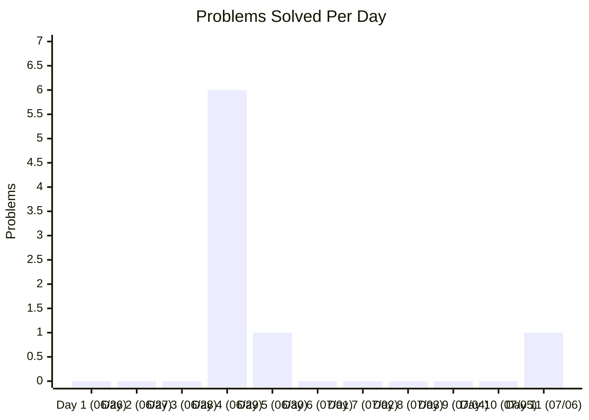
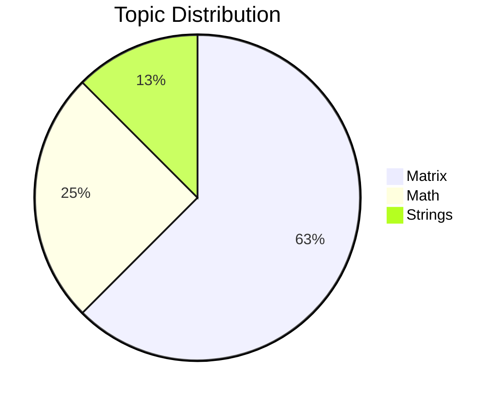

# 🧠 60 Days Hell Period - DSA Tracker

Welcome to my Data Structures and Algorithms (DSA) preparation repository! This space is dedicated to tracking my daily progress, coding challenges, and conceptual growth over a intensive 60-day sprint.

---

## 📊 Repository Statistics

| Metric | Details |
| :--- | :--- |
| **Total Problems Solved** | 8 |
| **Latest Problem** | [Right Triangle Number Pattern](file:///e:/60%20Days%20Hell%20Period/Matrix/Right%20Triangle%20Number%20Pattern.cpp) |
| **Last Updated** | 2026-07-06 |

---

## 📂 Topic-wise Progress

Below is the distribution of solved problems across various DSA topics:

| Topic | Count | Status |
| :--- | :---: | :--- |
| **Arrays** | 0 | 🟥 Not Started |
| **Strings** | 1 | 🟩 In Progress |
| **Linked List** | 0 | 🟥 Not Started |
| **Stack** | 0 | 🟥 Not Started |
| **Queue** | 0 | 🟥 Not Started |
| **Binary Search** | 0 | 🟥 Not Started |
| **Recursion** | 0 | 🟥 Not Started |
| **Backtracking** | 0 | 🟥 Not Started |
| **Trees** | 0 | 🟥 Not Started |
| **BST** | 0 | 🟥 Not Started |
| **Heap** | 0 | 🟥 Not Started |
| **Graph** | 0 | 🟥 Not Started |
| **Dynamic Programming** | 0 | 🟥 Not Started |
| **Greedy** | 0 | 🟥 Not Started |
| **Sliding Window** | 0 | 🟥 Not Started |
| **Two Pointers** | 0 | 🟥 Not Started |
| **Bit Manipulation** | 0 | 🟥 Not Started |
| **Matrix** | 5 | 🟩 In Progress |
| **Trie** | 0 | 🟥 Not Started |
| **Segment Tree** | 0 | 🟥 Not Started |
| **Disjoint Set** | 0 | 🟥 Not Started |
| **Math** | 2 | 🟩 In Progress |
| **Prefix Sum** | 0 | 🟥 Not Started |
| **Hashing** | 0 | 🟥 Not Started |

---

## 📅 60-Day Timeline & Daily Activity Tracker

Here is the progress tracker mapping every single problem solved to its specific day and date, starting from **June 26, 2026**.

### 📈 Daily Problem Count

### 🍕 Topic Coverage Distribution

### 📋 Day-wise Activity Ledger

| Day | Date | Problems Solved | Topic(s) | Daily Count | Cumulative Solved |
| :---: | :---: | :--- | :--- | :---: | :---: |
| **Day 1** | June 26, 2026 | Challenge Started! 🚀 | - | 0 | 0 |
| **Day 2** | June 27, 2026 | - | - | 0 | 0 |
| **Day 3** | June 28, 2026 | - | - | 0 | 0 |
| **Day 4** | June 29, 2026 | 1. [Number Checks and Loops](file:///e:/60%20Days%20Hell%20Period/Math/Number%20Checks%20and%20Loops.cpp) 2. [Character to Lowercase](file:///e:/60%20Days%20Hell%20Period/Strings/Character%20to%20Lowercase.cpp) 3. [Hollow Square Pattern](file:///e:/60%20Days%20Hell%20Period/Matrix/Hollow%20Square%20Pattern.cpp) 4. [Hollow Rectangle Pattern](file:///e:/60%20Days%20Hell%20Period/Matrix/Hollow%20Rectangle%20Pattern.cpp) 5. [Hollow Right Triangle Pattern](file:///e:/60%20Days%20Hell%20Period/Matrix/Hollow%20Right%20Triangle%20Pattern.cpp) 6. [Inverted Spaces Pattern](file:///e:/60%20Days%20Hell%20Period/Matrix/Inverted%20Spaces%20Pattern.cpp) | Math, Strings, Matrix | 6 | 6 |
| **Day 5** | June 30, 2026 | 7. [Sum of Digits Until Single Digit](file:///e:/60%20Days%20Hell%20Period/Math/Sum%20of%20Digits%20Until%20Single%20Digit.cpp) | Math | 1 | 7 |
| **Day 6** | July 1, 2026 | - | - | 0 | 7 |
| **Day 7** | July 2, 2026 | - | - | 0 | 7 |
| **Day 8** | July 3, 2026 | - | - | 0 | 7 |
| **Day 9** | July 4, 2026 | - | - | 0 | 7 |
| **Day 10** | July 5, 2026 | - | - | 0 | 7 |
| **Day 11** | July 6, 2026 | 8. [Right Triangle Number Pattern](file:///e:/60%20Days%20Hell%20Period/Matrix/Right%20Triangle%20Number%20Pattern.cpp) | Matrix | 1 | 8 |

---

## 🛠️ How it Works (Automated Repo Manager)

Every time a solution is added:
1. **Categorization**: The solution is analyzed and categorized into the appropriate topic folder.
2. **File Standardization**: Files are automatically renamed to `<Problem Name>.<extension>`.
3. **Documentation**: Individual topic directories receive a `README.md` to index the questions.
4. **Git Sync**: Changes are automatically committed and pushed to the remote repository.

---
*Keep grinding. Consistency is key.* 💪
